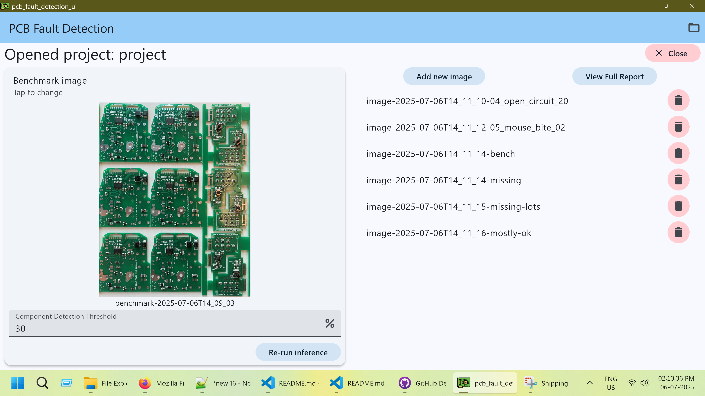
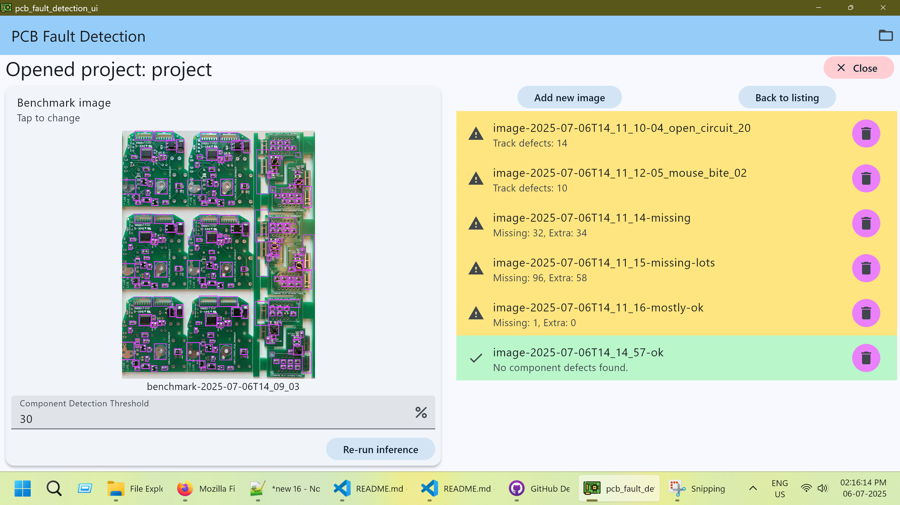

# pcb_fault_detection_ui

This is a Flutter desktop application designed to efficiently detect defects in Printed Circuit Boards (PCBs) directly from their images. Leveraging a powerful combination of Flutter for a responsive graphical user interface (GUI) and Rust for high-performance machine learning inference, this tool aims to simplify and accelerate the fault detection process.

It's built to assist in quality control and inspection by identifying issues in both copper tracks and soldered components.

## Key Features

- Intuitive Flutter GUI
- High-performance Rust backend
- Dual-model approach for comprehensive analysis
- YOLOv11 for defect detection
- YOLOv11 with SAHI for small object detection

## Explanation of the Dual-model approach

It uses two YOLOv11 models, each with a specific purpose:

- **Copper Track Defect Detection Model:** Designed to detect defects specifically within the PCB's copper tracks.
- **Component Detection Model:** Used to identify components soldered onto the PCB track.

The two models are mutually exclusive; that is, if an image is selected as a track image, then it cannot also be selected as a component image. This is because a PCB image containing components leads to many false positives when run on the track model.

The copper track defect model is executed directly on the selected images (after slicing).

The components are first detected on the image of a known good benchmark PCB. Then, images of other PCBs are selected and compared with the benchmark to find defects. This process also utilizes slicing.

## Usage & Resources

The intuitive Flutter GUI allows users to easily upload PCB images, select the desired detection model, and visualize the identified defects.

### Demonstration

See the demo at [this YouTube link](https://youtu.be/tCxNRT4C0cI) for more information.

### Screenshots

#### Initial Screen

After uploading PCB images:



#### Missing Components Report

Visualizing detected missing components on the PCB


#### Track Defects Report

Select this by checking "Is this a PCB track image?" in the UI.


#### Full Report

See at a glance which PCB images are faulty.



### Related Repositories & Resources

See the main model training repository & report at [pcb-fault-detection repo](https://github.com/aryan-programmer/pcb-fault-detection)

Also, the `./test_images` directory of the companion repository ([Link to `test_images`](https://github.com/aryan-programmer/pcb-fault-detection/tree/master/test_images)) contains the images used in the demo.

### How to download & install? (Binaries)

See the [Releases](https://github.com/aryan-programmer/pcb_fault_detection_ui/releases/tag/v0.1.0) tab. Download the [Application ZIP file](https://github.com/aryan-programmer/pcb_fault_detection_ui/releases/download/v0.1.0/pcb_fault_detection_ui.zip), extract it and run as shown in the video.

## Slicing

The images are sliced into smaller square sub-images and then sent to the model for inference, as this enables it to detect small components/track defects, improves detection accuracy for small objects. The results are then stitched together to get the final result. This is called [Slicing Aided Hyper Inference (SAHI)](https://ieeexplore.ieee.org/document/9897990).

This also helps overcome resolution limitations, as the YOLOv11 model can only take in inputs of size 640x640.

Much of the code for this has been adapted from the [Python SAHI implementation](https://github.com/obss/sahi), but translated to Rust.

## Why are you using Rust, and where are you using it?

This project utilizes the capabilities of the [`flutter_rust_bridge`](https://github.com/fzyzcjy/flutter_rust_bridge) framework to allow the Flutter UI to interface with the Rust code, while also automatically generating the necessary FFI (Foreign Function Interface) bindings.

Here, we use Rust to actually execute the ML model inference using the Rust [`ort 2.0.0-rc.10`](https://ort.pyke.io/) library. The models are stored in the ONNX format, which is compatible with `ort`, as it internally uses the ONNX Runtime library.

Also, we use Rust, and the [`image`](https://docs.rs/image/latest/image/) and [`ndarray`](https://docs.rs/ndarray/latest/ndarray/) libraries for image slicing.

Finally, we use the Rust [`rayon`](https://docs.rs/rayon/latest/rayon/) library, for easy & simple parallelism. It allows us to directly & easily run parallel operations on streams of data like (`map`, `filter_map`, `flatten`, various sorting functions, etc.) by using its parallel iterators.

Note: We have only compiled `ort` with DirectML support as the sole execution provider, along with the CPU fallback, of course. The reason for this is because the CUDA binaries significantly increased the application's size, and most devices we will demonstrate it on will not have a CUDA-compatible GPU (including the PC that this was developed on). So, for the sake of simplicity, other execution providers are not included. However, the `ort` library makes it very easy to add execution providers as necessary; so, if needed, they can be added. The code for using them is also included, but commented out.

## Compiling

Download and install Flutter & Rust. Then run:

```
flutter pub get
cd ./rust
cargo build
cd ..
flutter_rust_bridge_codegen generate
```

- Then, in the `./rust/target/debug` folder, you will find some `.dll`s, `.lib`s, or `.so` files depending on your platform.
- Copy the following files (or their equivalents) to a global directory (for example, `C:/local/onnxruntime-win-x64-1.22.0/lib/`):
  - `DirectML.dll`
  - `onnxruntime_providers_*.dll`
- Then, go to `./rust_builder/windows/CMakeLists.txt` (or the equivalent for your platform) and add to the last line, or replace it as shown below, to include the required binary files in the build. This step manually links the ONNX Runtime provider DLLs because they are not automatically bundled by `flutter_rust_bridge`'s cargo-kit integration in this setup.

```
set(rust_lib_pcb_fault_detection_ui_bundled_libraries
  "${${PROJECT_NAME}_cargokit_lib};C:/local/onnxruntime-win-x64-1.22.0/lib/DirectML.dll;C:/local/onnxruntime-win-x64-1.22.0/lib/onnxruntime_providers_shared.dll;C:/local/onnxruntime-win-x64-1.22.0/lib/onnxruntime_providers_shared.lib;C:/local/onnxruntime-win-x64-1.22.0/lib/onnxruntime.dll"
  PARENT_SCOPE
)
```

On Linux/macOS, look for `.so` or `.dylib` files respectively, and adjust paths accordingly. Like so:

```
set(rust_lib_pcb_fault_detection_ui_bundled_libraries
  "${${PROJECT_NAME}_cargokit_lib};~/.local/lib/onnxruntime-win-x64-1.22.0/lib/DirectML.so;~/.local/lib/onnxruntime-win-x64-1.22.0/lib/onnxruntime_providers_shared.so;~/.local/lib/onnxruntime-win-x64-1.22.0/lib/onnxruntime_providers_shared.so;~/.local/lib/onnxruntime-win-x64-1.22.0/lib/onnxruntime.so"
  PARENT_SCOPE
)
```

Note that these lists do not contain the CUDA binaries for the reasons explained before.

## Licensing

This project is distributed under the MIT license. See the `LICENSE.txt` file in this repository for the full text.

## Contributing

We welcome contributions! If you have suggestions for improvements, bug reports, or would like to contribute code, open an issue/pull request.
